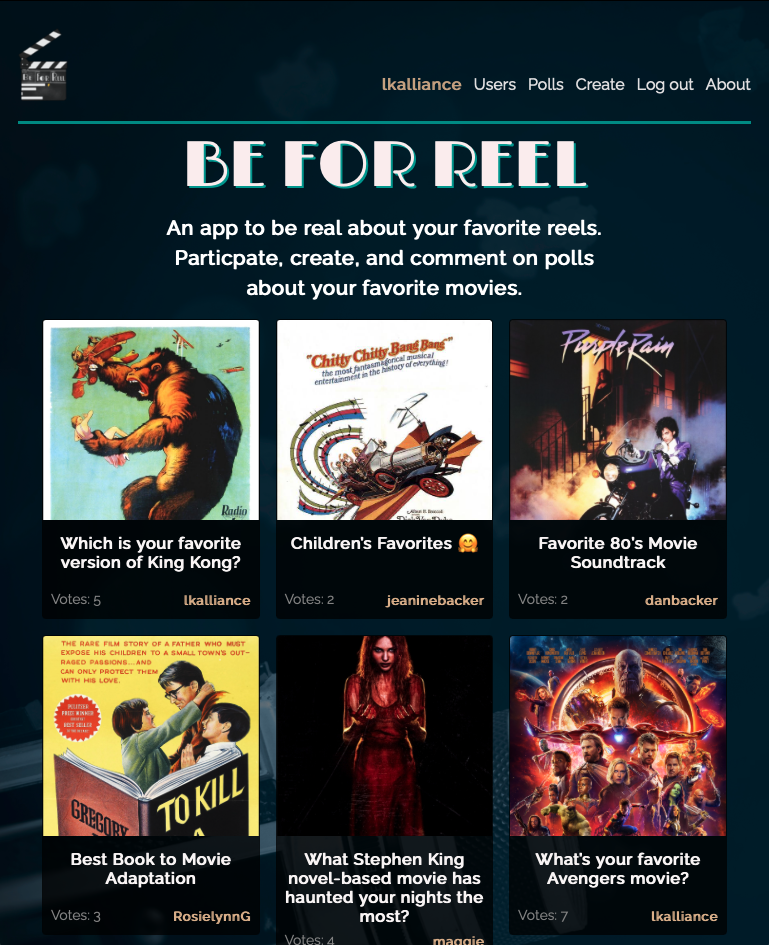
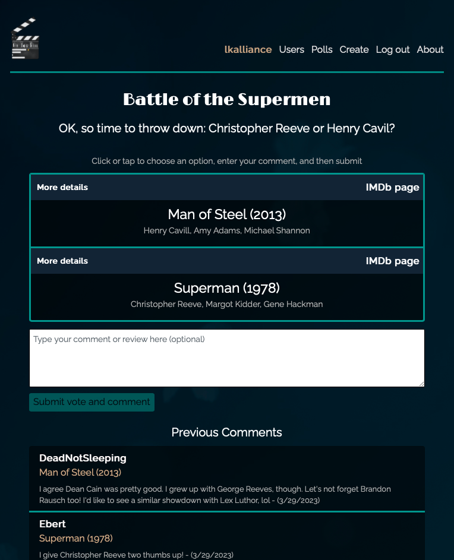
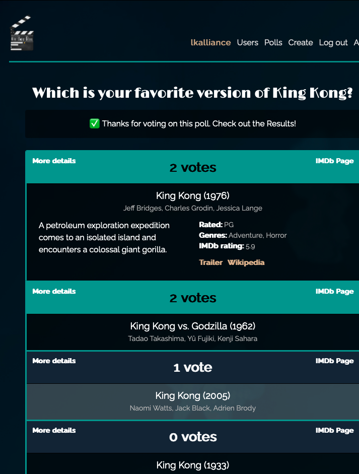
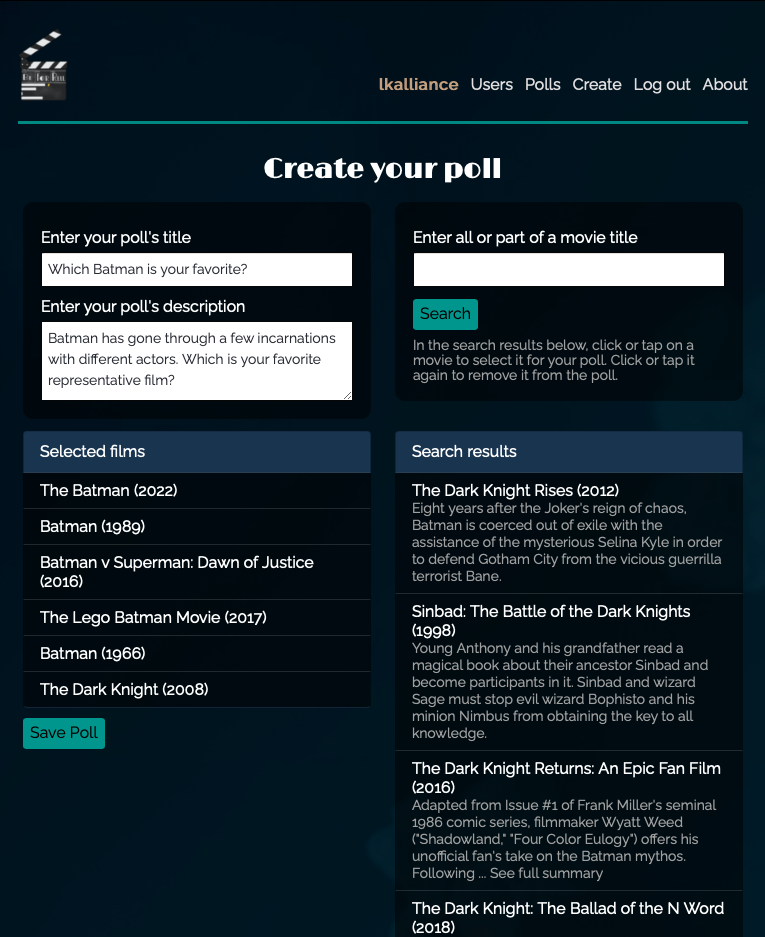
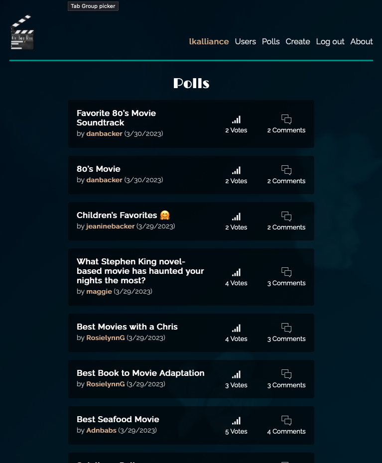

# Be For Reel 

## Description

Do you like movies? Most people do, at least a litle. Do you fondly remember the movies you grew up with (or are growing up with now)? I'd bet you do too. Do you like the Oscars? Well, that question will get a more mixed set of responses.

Be for Reel wants to bring to users the feelings that Oscar season stirs in movie buffs every year (which would be similar to the feelings that sports stir in many people). The feeling of having an emotional stake--if even just a small one--in who wins and loses. It's an emotional stake that many people lack surrounding the Oscars. Be For Reak is like the  Oscars for the rest of us.

Be For Real is a site for lovers of movies, and for lovers of debating, reviewing, and comparing movies. It is a place where users create polls inviting others to choose their favorite from among the presented group of movies. And since the subject of your poll is completely up to you, and is a subject on which you probably have an opinion, and involves films you've probably seen, then you probably are interested in who wins. When you feel that way, YOU win.

Along the way, users can submit a comment with their vote, which comment is made visible along with the vote. Make your case, or review the movie, or just express what the poll made you feel. Be a part of the community.

## Table of Contents

* [Installation Instructions](#installation-instructions)
* [Usage Information](#usage-information)
* [Application Features](#application-features)
* [Design Notes](#design-notes)
* [Contribution Guidelines](#contribution-guidelines)
* [Credits](#credits)
* [Software License](#software-license)
* [Contact the Developer](#contact-the-developer)

## Installation Instructions

Users interact with Be For Reel over the Web, so no installation is necessary, just a Web browser. You do need to have JavaScript enabled, and to accept cookies to maintain your logged-in status.

## Usage Information

There is no charge to be a member on Be For Reel, but a membership is required to participate. People without a membership or who are not currently logged in can see all the available polls, can can see what the options are...but cannot vote or see any comments. All functions are available to users with a free membership.

The [home page](https://be-for-reel-app.heroku.com) of the app features six randomly-chosen polls, and each is displayed with the movie poster from a randomly-chosen option on each poll. The user can click on any of the pictures or the headlines to view the poll.

When on the poll's page, the user may vote and comment if they haven't yet done so, or else they will see the current voting tally. In both states they will see comments left by other users. Voting is simply clicking on the title of any of the given movies, then (optionally) entering a comment in the field below, and then clicking the button to submit. Voting is the user's one chance to leave a comment.

Whether on the voting page or just the viewing page, each movie comes with a selection of data about the movie: the stars, a brief description of the plot, its rating, the genres it belongs to, its IMDb user score, and links to its IMDb page, its Wikipedia page, and it's movie trailer. All of this data is automatically included with each film in the poll, with no effort required by the user.

[Creating the poll](https://be-for-real-app.heroku.com/polls/create) (membership required) is simple. The user enters a title and description of the poll, and then can do a series of searches on the titles of films they would like to include. Search results appear in a column, with the title of the movie and a brief plot description. The user can click or tap on any of the search results to select the film for their poll, and it moves to the "Selected Films" column. If the user decides against that film, they can tap it again to remove it from among the selected films. Then click the button to save the poll.

Users can access the list of all polls on a [poll directory page](https://be-for-real-app.heroku.com/polls), where each poll is listed with its total current number of votes and comments. Or they can see a [user directory page](https://be-for-real-app.heroku.com/users), where all members are listed. Click on any member's name anywhere on the site to view the user's profile, which displays all the polls that user has created, as well as all the comment's they've made and the vote selections that accompany them.

## Application Features

* Simple voting interface, with the chance for a voter to attach a text comment that is listed with the poll.
* Enriched data for each film listed in each poll, with stars, plots, ratings and more, plus links to the film's pages on IMDb and Wikipedia, and to its theatrical trailer, if available.
* Simple poll creation tool based on film title searches
* User profiles that aggregate a member's created polls and comments left
* Complete directories of both polls and users

## Design Notes

Most design decisions on coding were pretty straightforward once certain we decided on what content required a membership to see. We put a premium on keeping things clean and focused, so we opted to make poll options require a movie search and did not provide the ability to write the text of the options. To keep things more family-friendly, we opted to weed out films rated NC-17 or X from search results. We've also screened for movies that do not have an IMDb-provided brief plot synopsis. This decision eliminated films that most people wouldn't have heard of, and films that aren't yet released. The cost was potentially eliminating indie films that we'd like to have in there, but we opted to make the trade-off.

Out of respect for IMDb, we opted not to store the data from their APIs locally. We did make two concessions to that policy: we store the title of the movie, and the URL for the movie poster image. This saves us six calls to their API just for loading the home page. We do still call their API once for each option on a poll when generating a page, and for movie title searches during the poll creation process.

The visual design of the site came together very early, the dark theme with splashes of color intended to be reminiscent of being at a movie theater.

## Contribution Guidelines

Anyone can become a member for free on Be For Reel, and with a free membership can create as many polls as they wish and vote on as many polls as they wish. Poll film options do not include NC-17 or X-rated films.

The code base is not currently accepting contributions from the public.

## Credits

The team that conceptualized, designed, and wrote the code for Be For Reel include Justin Brueske, Elsadek Elnimiry, Lee Klusky, Maggie McQuown, and Gabriella Swenson. Guidance and support provided by the instructors and staff of the University of Minnesota Full Stack Coding Bootcamp.

This app was written using Node.js and using several open-source modules, most especially [Express](https://expressjs.com), [Sequelize](https://sequelize.org) and [Bootstrap](https://getbootstrap.com). Site logo designed by Rachel Klusky.

This application is powered by a free API from [IMDb.com](https://www.imdb.com), which provides all movie data and links to all imagery. Images hosted by [Amazon.com media](https://www.amazon.com). IMDb icon provided by [ICONS8](https://www.icons8.com).

This application wouldn't be possible without the coding wisdom found all over the Web at places like [Stack Overflow](https://www.stackoverflow.com), the [Mozilla Developer Network](https://developer.mozilla.org) and [W3Schools](https://w3schools.com).

## Software License

©2023, Be For Reel App Team

This software is covered by a [MIT License](https://opensource.org/licenses/MIT).

Permission is hereby granted, free of charge, to any person obtaining a copy of this software and associated documentation files (the "Software"), to deal in the Software without restriction, including without limitation the rights to use, copy, modify, merge, publish, distribute, sublicense, and/or sell copies of the Software, and to permit persons to whom the Software is furnished to do so, subject to the following conditions:

The above copyright notice and this permission notice shall be included in all copies or substantial portions of the Software.

THE SOFTWARE IS PROVIDED "AS IS", WITHOUT WARRANTY OF ANY KIND, EXPRESS OR IMPLIED, INCLUDING BUT NOT LIMITED TO THE WARRANTIES OF MERCHANTABILITY, FITNESS FOR A PARTICULAR PURPOSE AND NONINFRINGEMENT. IN NO EVENT SHALL THE AUTHORS OR COPYRIGHT HOLDERS BE LIABLE FOR ANY CLAIM, DAMAGES OR OTHER LIABILITY, WHETHER IN AN ACTION OF CONTRACT, TORT OR OTHERWISE, ARISING FROM, OUT OF OR IN CONNECTION WITH THE SOFTWARE OR THE USE OR OTHER DEALINGS IN THE SOFTWARE.

## Questions?

Visit my [GitHub profile](https://www.github.com/lkalliance).